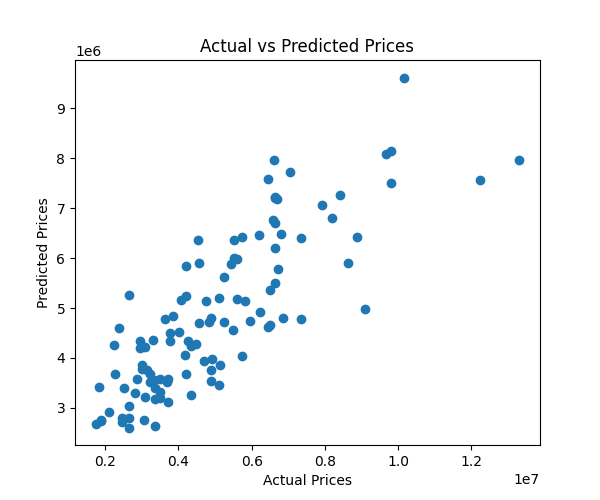
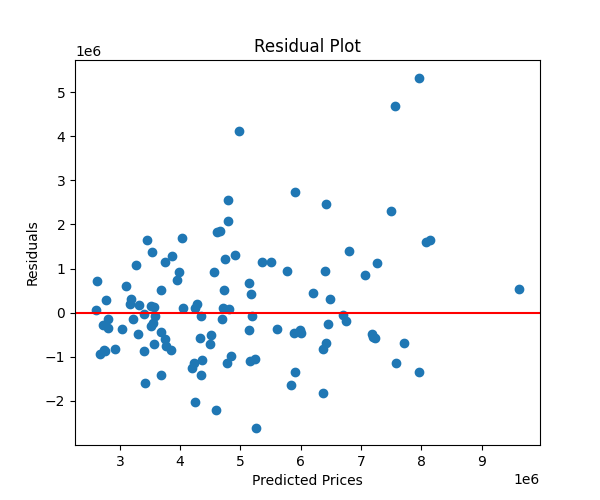
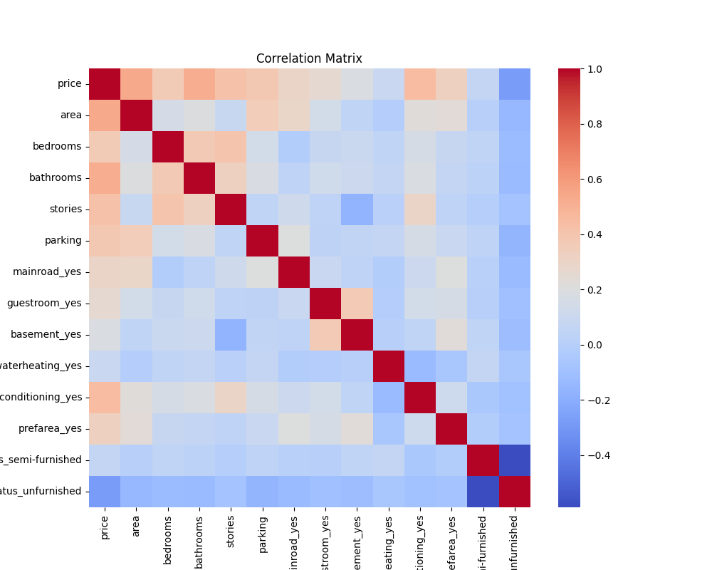

# 🏠 House Price Prediction – Linear Regression

## 📌 Objective

To implement Simple & Multiple Linear Regression using the Housing dataset and evaluate model performance using standard regression metrics.

## 🛠 Tools Used

1. Python

2. Pandas

3. Scikit-learn

4. Matplotlib

5. Seaborn

## 📂 Dataset

Dataset: Housing Price Prediction Dataset

Target Variable: price

## ⚙️ Steps Performed

1. Imported and explored dataset

2. Converted categorical variables using one-hot encoding

3. Split data into training and testing sets (80/20)

4. Applied Linear Regression model

5. Evaluated using:

  * MAE
    
  * MSE

  * R² Score

6. Visualized results

## 📊 Model Evaluation Metrics

  MAE (Mean Absolute Error) – Measures average absolute prediction error

  MSE (Mean Squared Error) – Penalizes larger errors

  R² Score – Shows how well features explain target variance

## 📈 Generated Graphs

### 1️⃣ Actual vs Predicted Prices

Shows model prediction performance.

### 2️⃣ Residual Plot

Helps check if residuals are randomly distributed.

### 3️⃣ Correlation Matrix

Displays relationships between variables.

## 📌 Key Observations

Model shows reasonable predictive performance.

Some features strongly correlate with price.

Residual distribution helps verify regression assumptions.

## 🎯 Conclusion

Linear Regression was successfully implemented and evaluated.
The dataset demonstrates how multiple features influence house prices.
